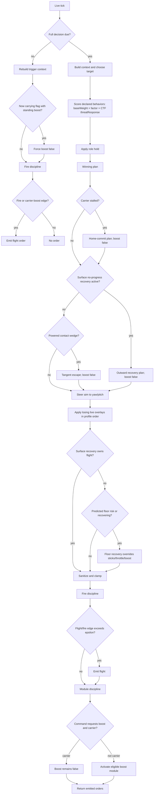

# Bot behavior map

This document maps the shipped bot controller after the per-module heat/energy change. Bots consume the same read-only `Snapshot` as clients and emit ordinary `flight` and `moduleToggle` orders; room wiring seeds each driver from match seed plus entity id (`server/src/rooms/ArenaRoom.ts:464-516`).

## Decision pipeline

`update` does nothing outside the live phase, staggers the first decision, calibrates turn/pitch every live tick, and otherwise chooses between a full utility decision and a trigger-only fire update (`shared/src/bots/BotDriver.ts:326-344`). Full-decision spacing is `max(16 ms, decisionIntervalMs ± orderJitterMs)` (`shared/src/bots/BotDriver.ts:435-438`).

1. Build a preliminary context, choose a maneuver target, then rebuild against that target. Context contains enemies/allies, 3D range and LoS, incoming missiles, hottest per-module heat fraction, and emptiest per-module energy fraction (`shared/src/bots/BotDriver.ts:448-467`, `shared/src/bots/context.ts:114-196`).
2. Score only behavior keys declared by the profile. Utility is `baseWeight × situational factor`; `engage` also gets `ctfWeights.threatResponse` in CTF. Positive-factor behaviors with overlays remain live even if their weighted utility loses (`shared/src/bots/BotDriver.ts:469-490`). CTF objective/combat role changes can be held for `roleHoldMs` (default 2,500 ms) (`shared/src/bots/BotDriver.ts:493-501`).
3. Ask the winner for a plan, then replace that plan in this order: carrier no-progress home commit, all-surface progress recovery, powered-contact tangent escape. Later calls have precedence because each receives the prior result; an active surface escape suppresses the tangent escape (`shared/src/bots/BotDriver.ts:503-506`, `shared/src/bots/BotDriver.ts:932-1057`).
4. Treat an objective plan as trigger-engaged when a visible target lies inside `weaponRange × opportunisticCombat`, without changing its route (`shared/src/bots/BotDriver.ts:507-515`).
5. Convert the aim point to yaw/pitch sticks. Imperfect aim is applied only to engaged combat plans. Every losing live overlay is then applied in profile declaration order; shipped overlays are missile `dodge` and `avoidRocks` (`shared/src/bots/BotDriver.ts:517-552`, `shared/src/bots/behaviors.ts:478-490`, `shared/src/bots/behaviors.ts:530-543`).
6. Predictive floor avoidance runs last and can rewrite both sticks, throttle, and boost. It is skipped while measured surface recovery owns the command (`shared/src/bots/BotDriver.ts:553-566`). Thus floor avoidance outranks behavior overlays, while surface recovery outranks floor avoidance.
7. Clamp/sanitize the command and emit a level-triggered `flight` order only on a stick/throttle/boost/fire edge beyond profile epsilons (`shared/src/bots/BotDriver.ts:558-583`, `shared/src/bots/BotDriver.ts:733-746`). Fire is re-evaluated every tick between utility decisions (`shared/src/bots/BotDriver.ts:686-730`). A newly acquired flag immediately cancels a standing boost request; objective carrier plans also always request `boost: false` (`shared/src/bots/BotDriver.ts:689-696`, `shared/src/bots/ctfBehavior.ts:46-53`).
8. Run module discipline and append its toggles. A requested boost additionally activates a retracted boost module only when that module's own tank meets its `rearmAbove` threshold (`shared/src/bots/BotDriver.ts:585-605`).

## Registered behaviors

All six general behaviors self-register at `shared/src/bots/behaviors.ts:564-569`; `objective` registers separately at `shared/src/bots/ctfBehavior.ts:144`. Parameter fallbacks are the values read by the implementation; editor metadata is collected at `shared/src/bots/behaviors.ts:624-685`.

| Behavior | Scores when / factor | Winning plan | Shipped profiles | Parameters and defaults |
|---|---|---|---|---|
| `engage` | Target exists. `(0.5 + 0.5×hullFraction)`, up to ×2 beyond preferred max, ×`tooCloseFalloff` inside min, ×`noLosFalloff` without LoS (`behaviors.ts:151-163`). | Aim at target; approach/band/close throttle; turn-throttle on hard reversals; boost only while far (`behaviors.ts:165-179`). | all | `throttleApproach` 1, `throttleBand` .55, `throttleClose` .2, `hardTurnRad` 1.2, `throttleTurn` .35, `tooCloseFalloff` .6, `noLosFalloff` 1.2, `targetPreference` nearest, `losPenalty` 2, `holdLockTarget` true, `boostChance` 0; optional aim-error fields are driver-read (`behaviors.ts:627-637`, `BotDriver.ts:639-678`). |
| `kite` | Target inside `breakRange` (default preferred min); `1 + proximity×urgencyGain` (`behaviors.ts:216-223`). | Extend away with yaw/optional vertical slip, full throttle by default (`behaviors.ts:224-251`). | all | `urgencyGain` 1, `breakRange` preferred min, `standoffFrac` .9, `slipRad` .5, `verticalSlipRad` 0 in runtime, `throttleRun` 1, `boostChance` 0 (`behaviors.ts:219-251`). |
| `breakLoS` | Target and LoS and reachable cover; optionally only below `triggerHullBelow`; factor `1 + hull-depth×urgencyGain` (`behaviors.ts:299-312`). | Fly to nearest searched point actually hidden behind an asteroid; not engaged (`behaviors.ts:313-322`). | aggressive, cautious | `triggerHullBelow` absent, `urgencyGain` 1, `coverOffset` 3, `coverSearchRadius` 2×preferred max, `throttle` 1, `hardTurnRad` 1.2, `throttleTurn` .35, `boostChance` 0 (`behaviors.ts:648-656`). |
| `retreat` | Enemies exist and configured hull/shield trigger fires; with no triggers it is always eligible. Factor grows with hull-depth (`behaviors.ts:334-345`). | Fly away from enemy centroid in 3D at full throttle/boost by default; not engaged (`behaviors.ts:346-369`). | aggressive, cautious | `triggerHullBelow` absent, `triggerShieldDown` false, `urgencyGain` 1, `retreatDistance` 2×preferred max, `throttle` 1, `boostChance` 1 (`behaviors.ts:658-664`). |
| `dodge` | Inbound missile within `dodgeRadius`; `1 + proximity×urgencyGain` (`behaviors.ts:437-444`). | If winner, break perpendicular to missile track with optional climb; if loser, add deterministic alternating yaw/pitch jink (`behaviors.ts:445-490`). | aggressive, cautious | `dodgeRadius` 20, `dodgeDistance` 12, `dodgeClimbRad` .4, `throttle` 1, `jinkAmp` .4, `jinkPitchAmp`=`jinkAmp`, `jinkPeriodSec` .8, `jinkPhasePerId` .618, `urgencyGain` 1, `boostChance` 0 (`behaviors.ts:666-676`). |
| `avoidRocks` | Nose corridor intersects an asteroid; factor 1 (`behaviors.ts:511-514`, `behaviors.ts:553-561`). | If winner, yaw sidestep; normally weight 0 makes it a pure turn/throttle overlay (`behaviors.ts:515-543`). | all | `lookahead` 16, `clearance` 2, `turnBias` .8, `throttleFactor` 1, winning `throttle` .6 (`behaviors.ts:678-684`). |
| `objective` | A CTF job exists; factor is that job's urgency (`ctfBehavior.ts:27-34`). | Aim at job; terminal flag/base jobs declare their contact radius and a maximum arrival throttle, while the driver derives the actual cap from measured speed and turn/pitch rates. Hold at zero only when a carrier is home-blocked, never boost on terminal approach, `engaged:false`. | all | Authored `arriveThrottle` remains an upper bound; the default kinematic arrival controller converges without hull-specific tuning. Other defaults are unchanged. |

Profiles are authored at `content/bots/aggressive.json:28-103`, `content/bots/cautious.json:28-104`, `content/bots/flagrunner.json:32-87`, and `content/bots/rookie.json:32-85`. Their nonzero weights—not registry membership—determine what can win.

## CTF objective ladder

`chooseJob` returns at the first applicable rung, so this is strict precedence (`shared/src/bots/ctfBehavior.ts:64-130`). The final utility is still objective `baseWeight × urgency` in the driver.

| Priority | Job | Aim | Urgency factor before objective base weight |
|---|---|---|---|
| 1 | Carry enemy flag home | Own flag home, or enemy home fallback | `carryUrgency(3) × takeEnemyFlag`; blocked when own flag is away (`ctfBehavior.ts:72-79`). |
| 2 | Recover dropped own flag | Own flag position | `recoverUrgency(2.2) × returnOwnFlag`; urgency halves beyond `recoverRange(90)` (`ctfBehavior.ts:82-86`, `ctfBehavior.ts:137-142`). |
| 3 | Hunt own-flag carrier | Carrier position | `chaseUrgency(1.6) × killEnemyCarrier` (`ctfBehavior.ts:88-97`). |
| 4a | Escort friendly carrier | Point 20% of the carrier-to-home vector ahead | `escortUrgency(1.15) × escortOwnCarrier` (`ctfBehavior.ts:100-115`). |
| 4b | Take/defend | Enemy flag, unless defend utility is larger | max of `attackUrgency(1) × takeEnemyFlag` and, while own flag is home, `defendUrgency(.45) × defendOwnBase` (`ctfBehavior.ts:118-128`). |

`threatResponse` scales only `engage` utility in CTF; `opportunisticCombat` scales the objective route's fire range; `roleHoldMs` controls objective/combat stickiness (`shared/src/bots/BotDriver.ts:482-498`, `shared/src/bots/BotDriver.ts:509-514`).

## Fire discipline

The trigger is level-triggered and its only memory is `heatHeld` (`shared/src/bots/fireDiscipline.ts:25-28`). The gate order is: engaged → sensor lock → authored discipline/armed active weapons → shortest armed range × `engageRangeMult` → heat hysteresis → weapon-tank energy floor → burst clock (`shared/src/bots/fireDiscipline.ts:41-103`).

Heat is per rack. The shared trigger enters `heatHeld` only when every active rack is at or above `heatHeadroom` (default 1), and exits when any rack cools to or below `rearmHeatBelow` (default headroom). This lets cool racks continue while the combat system independently skips an overheated one (`shared/src/bots/fireDiscipline.ts:56-76`). Energy is the minimum fraction only among active weapons that actually own tanks; shipped weapons have none, so shield/boost energy cannot silence guns (`shared/src/bots/fireDiscipline.ts:78-91`). Optional bursts use deterministic driver ticks (`shared/src/bots/fireDiscipline.ts:93-101`).

## Module discipline

Transitional, overheated, weapon, and internal-family modules are skipped (`shared/src/bots/moduleDiscipline.ts:70-82`). For each remaining module:

- Active → retract when `max(own heat fraction, hottest rack fraction) >= heatShutdownAt`, or when it is a shield with `shieldOnlyWhenEngaged` and the trigger engagement is false.
- Retracted → remain retracted above `reactivateBelow`; otherwise activate if the energy reserve gate passes.
- Active modules otherwise remain active, avoiding deploy-timer chatter (`shared/src/bots/moduleDiscipline.ts:84-110`).

The energy reserve gate compares each candidate module with its own `energy / energyCapacity`; a module without a tank is treated as fully supplied (`shared/src/bots/moduleDiscipline.ts`). The context still exposes the emptiest-tank aggregate for diagnostics, but module activation does not consume it.

## Loadout adaptation

Ship choice is seeded from the allowed pool. For a fitting, every socket filters the full module catalogue by accepted family, then weighted choice favors weapons 4× for aggressive profiles, tank modules 4× for cautious profiles, and weapons/tank 2× for balanced profiles (`shared/src/bots/botLoadout.ts:29-40`, `shared/src/bots/botLoadout.ts:84-104`).

If a player fitting exists, its power score is the sum of `level×100 + log2(price+2)×12`; the bot samples a target uniformly within `fittingPowerSpread` (default ±25%) and retains the closest viable roll across 2,000 attempts (`shared/src/bots/botLoadout.ts:74-110`). A roll is viable only with at least one weapon, at least one weapon that can online within resolved power, and every weapon capable of a cold burn of at least two seconds after hull cooling, heat-generation, and heat-store multipliers (`shared/src/bots/botLoadout.ts:43-71`). Failure falls back to the socket-aligned stock fit (`shared/src/bots/botLoadout.ts:110-113`). Existing loadout tests cover socket legality and viability; the audit also records every rolled fitting.

## Audit results (2026-08-07)

`tools/bot-behavior-audit.ts` runs two seeded 10v10 lunar-crater CTF matches to the match end/cap and one seeded ring-nebula team deathmatch, using randomized legal loadouts. It records per-bot/team objective, combat, trigger, rack, overlay, movement, and energy measurements and prints threshold-based issues.

The final run produced CTF results of 2–1 at 600.0 s (seed 11) and 3–0 at 417.2 s (seed 73), plus a 25–17 deathmatch completed at 623.7 s. Across the combined runs, objective occupancy was 100.0% flagrunner, 36.6% aggressive, 74.4% cautious, and 28.7% rookie. Aggregate rack lockout remained near zero (individual CTF maximum 1.7%), while per-bot engaged fire uptime ranged from 0–24.8% in CTF. These numbers show neither permanent thermal lockout nor an always-firing bypass; low CTF fire uptime mostly reflects objective routing and lock/range gates.

## Issues

### FIX NOW: standing boost survived flag pickup

Objective plans correctly set carrier boost false, but a bot could pick up a flag between decisions while its previous level-triggered command still requested boost. The sim refused acceleration, yet the audit saw five carrier ticks with boost intent. Trigger updates now cancel that edge immediately (`shared/src/bots/BotDriver.ts:689-696`). Regression: `BotDriver.test.ts` — “cancels a standing boost request immediately when the bot takes a flag.”

### FIXED: objective travel could lower engagement-only shields under fire

Objective plans still return `engaged:false`, and opportunistic trigger engagement remains range/LoS-bound. `BotDriver` now latches threat for 4,000 ms after its observed hull or summed shield pool drops, or while an inbound missile is detected inside the existing scan radius. Only module discipline receives `triggerEngaged || underThreat`; steering, firing, utility scores, and the recorded engagement flag remain unchanged. Regression: `BotDriver.test.ts` — “raises an engagement-only shield after objective-travel damage outside opportunistic range.”

### FIXED: energy reserve coupled independent module tanks

Module activation now compares the candidate module's own `energy / energyCapacity` with `energyReserve`; an empty boost bottle no longer blocks a charged shield. The aggregate remains in context because diagnostics consume it, but module discipline does not. Regression: `moduleDiscipline.test.ts` — “gates shield activation on the shield's own tank, not an empty boost tank.”

### FIXED: enclosing-shell contact recovery coverage

Room, offline-session, and audit wiring pass arena bounds to `BotDriver`. The inside of a spherical shell is a rest surface with an inward recovery normal for both the no-progress watchdog and powered-contact tangent escape; entry/exit clearance retains the visual-overhang allowance for heavy hulls. Regression: `BotDriver.test.ts` — “arms surface recovery after stationary contact with the enclosing sphere.” This is valid shell-contact coverage, but it was not the cause of the seed-11 stalls: the probed bots were near the flag base, roughly 80 units inside the radius-360 shell.

## Final-approach orbit: root cause and fix

The seed-11 per-tick replay placed bot 43 at roughly `(274,31,5)` aiming at the enemy flag at `(268,16,0)`: only about 17 units away, with throttle 0.4, no recovery overlay, and nowhere near the arena shell. The fixed `arriveRange`/`arriveThrottle` assumption let re-authored hulls settle into a final-approach orbit outside the flag contact sphere. Holding y≈31 was part of that 3D orbit; predictive floor avoidance was inactive and its safe band lies below the y=16 flag, so no bubble-altitude clamp needed weakening.

Terminal objective plans now declare `arrive` plus the actual flag/base contact radius. `BotDriver` applies `throttleForPointArrival` from `flight.ts`: it measures current speed and calibrated yaw/pitch rates, blends the angular rate by the approach's vertical fraction, and caps authored throttle so `v / angularRate <= 0.5 × distanceRemainingToContactSphere`, clamped to `[0.01, planThrottle]`. Authored `arriveThrottle` is therefore still an override/upper bound, while the default works across fitted hull kinematics. Boost is disabled only during terminal arrival. Surface escape explicitly clears arrival intent; floor avoidance still runs afterward and retains crash authority.

Regression coverage in `CtfBots.test.ts` places the shipped flagrunner profile and the seed-11 shipped interceptor fitting 30 units from a lunar home flag, 15 units high, with full lateral way. It must enter the shipped pickup sphere within ten nominal travel times (`10 × 30 / resolvedNominalSpeed`), so the bound scales with content rather than wall-clock guesswork. The enclosing-shell recovery test remains, relabelled as shell-contact coverage. The audit's stall window was also corrected to reset during cut-throttle loiter/respawn waits; those waits accounted for the prior 39 zero-motion records and are not powered flight stalls.

### Same-seed before/after audit

| Seed | Arrival controller | Captures by team | Attempts by team | Powered 10 s stalls | End |
|---|---:|---:|---:|---:|---:|
| 11 | before | 2–2 | 4–3 | 0 | 600.0 s cap |
| 11 | after | 3–0 | 6–1 | 0 | capture limit, 294.8 s |
| 73 | before | 2–0 | 4–2 | 0 | 600.0 s cap |
| 73 | after | 3–1 | 6–4 | 0 | capture limit, 379.5 s |

The old audit printed 39 “stalls” because its window included zero-throttle waits; under the corrected powered-window definition both controller variants report zero. The important route result is independent of that instrumentation correction: attempts rise from 7→7 on seed 11 and 6→10 on seed 73, and both post-fix matches reach the authored three-capture limit well before 600 seconds. The old `|x|≈273, y≈31` outside-pickup hover is absent from the final worst-stuck table (the table is empty). Aggregate energy starvation is 2.1%; objective shield-down incoming-hit fraction is 62.0%. Deathmatch remains 25–17 at 623.7 s.

### FINDING: floor and surface recovery do not form one invariant

Predictive floor avoidance uses collider radius only and commands positive recovery throttle, while the no-progress watchdog expands entry/exit clearance by visual overhang (`shared/src/bots/BotDriver.ts:815-871`, `shared/src/bots/BotDriver.ts:978-1010`). During an active surface escape, floor prediction is wholly skipped to prevent rock/floor seam deadlock (`shared/src/bots/BotDriver.ts:553-556`). The composition is safe for the tested floor, blocked-home zero-throttle, carrier, and visual-overhang cases only after a 1.5 s stationary detection; it is not a proof that every state maintains immediate surface progress. Proposed fix: replace the two owners with one bounds-aware recovery controller that combines active contact normals and uses visual extent consistently.

### FINDING: behavior personality spread is role-dominant

Measured combined occupancy differs strongly—flagrunner 100% objective, cautious 74.4%, aggressive 36.6%, rookie 28.7%—so multipliers do produce spread. The flagrunner's complete objective lockout means its combat behavior weights never win in sampled CTF, even though opportunistic fire still occurs. Proposed fix, if the owner wants occasional flagrunner combat maneuvers, cap objective utility or assign only a subset of flagrunners to attack roles; otherwise document this as intended specialization.

## Twin Titans duel audit (2026-08-07)

The audit now permanently runs Twin Titans rookie-interceptor 1v1, rookie-brawler 1v1, and mixed interceptor/brawler 2v2 matches for seeds 7, 17, and 42. Each 1v1 ran to the 600.0 s cap. The mixed 2v2 matches ended at 450.9, 518.9, and 470.5 s. Strict accumulated-motion detection reported zero powered 10 s stalls before and after the fix; aggregate duel behavior occupancy changed from 84.1% engage / 14.8% kite / 1.1% none to 84.7% / 14.2% / 1.0%, and aggregate energy starvation remained 3.0%.

The focused shipped-geometry probe covers the unsampled failure band directly. A 1.4-scale colossal has rendered radius 25.20 and collider radius 23.94. With the brawler's rendered radius 3.60 and collider radius 2.10, a centre distance of 28.30 yields collider clearance +2.26 but rendered clearance -0.50. Before the fix, the ship-only visual threshold was +1.85 and surface recovery remained false after 1.7 s. After asteroid visual overhang is included, recovery is true at 1.7 s and aims outward. The full-match audit also resets a retained driver while its entity id is absent, matching the practice host's respawn lifecycle and excluding stale-order respawn artifacts.

## Parked nose-down: the floor-avoidance deadlock (2026-08-08)

Owner report from a live CTF match: "most of the bots were facing down and not moving." The behaviour audit reproduced it. Alive bots commanded near-zero throttle for 55–97% of their live ticks across every profile while behaviour occupancy stayed normal, and on CTF seed 73 team 0 finished the match with zero capture attempts.

### Mechanism

Instrumenting CTF seed 73 bot 43 (flagrunner, 93.6% zero-throttle) over its stalled window showed a healthy plan and a dead command. At t = 41.4 s the winning plan was `objective` with throttle 1.0 and a steer of `turn +0.026, pitchStick −0.661`; the command actually emitted was `turn 0, pitchStick 0, throttle 0`. The bot then held position `(−225.826, 14.622, 163.863)` at speed 0.00 and pitch −1.412 rad — nose 81° down — for the remaining 558 s of the match. `floorRecovery` and `surfaceRecovery` were both false throughout, which is why `floorPct`/`surfacePct` ≈ 0 did not exonerate floor avoidance.

`avoidFloor`'s predictive branch owned the command. With `floorY = 0` and a 1.4 collider, the safety altitude is `max(1.4×4, 1.4+3) = 5.6` and the recovery target was the absolute altitude `safeY + band = 9.6`. The hull sat at 14.62, so the anti-crash overlay was aiming five units *below* the ship. Three defects compose into an absorbing state:

1. **The lift target could be below the hull.** `safeY + band` is absolute, and the predictive branch fires mostly at hulls already well clear of it — only the projection is bad. The overlay therefore steered the nose down.
2. **A nose already down reads as "on target".** With the target 5.02 units below and the nose at −1.412 rad, both steering errors (yaw 0.108, pitch 0.118 rad) fell inside the flagrunner's authored `aimToleranceRad` of 0.14, so `steerForPoint` centred both axes: `lift = {turn: 0, pitchStick: 0}`.
3. **The throttle cut had no floor.** `strength` was 1 and `self.pitch < 0`, so the predictive branch produced exactly 0. The projection then reads the *plan's* throttle, not the commanded one: `projectedVy = min(0, sin(−1.412)×20×1) = −19.75`, giving `predictedY = −34.75` against `safeY = 5.6`. A hull at a dead standstill was permanently predicted to crash, so the override never released.

The nose-down attitude was itself produced by the same rule. At t = 39.9 s, y = 33.99, the overlay commanded `pitchStick −0.413` and throttle 0; by t = 40.6 s pitch had reached −1.412 and the steering had collapsed to zero.

A second, independent defect latched at t = 19.8 s while the hull was passing through vertical: `turnRateEst` jumped to 91.93 rad/s against a true hull rate near 2.4. Calibration divided the observed `heading` change by the commanded stick, but with pitch free (the shipped case) the sim integrates the real frame and re-derives `heading`/`pitch` from the resulting nose, so a hull crossing the pole shows most of a turn of heading change for almost no body yaw. Because a 91.93 rad/s hull answers every bearing error with a stick of about 0.02 — below `CALIBRATION_MIN_TURN` — the estimate could never be re-measured. One poisoned tick disabled the yaw axis for the rest of the match. End-of-match estimates across the two CTF seeds included 91.93, 103.12, 169.38, 442.06, 524.31, 576.30 rad/s on yaw and up to 1177.62 on pitch.

### Fixes

- `avoidFloor` now climbs from the hull's own altitude, `max(safeY, pos.y) + band`, and leads the climb along the ship's heading at 45° rather than aiming straight overhead — a point directly above a nose-down hull is anti-parallel to the nose, which is the singular case of the two-axis body decomposition.
- The predictive throttle cut keeps `min(planThrottle, 0.3)` under it while hull speed is below 4. A moving hull diving at the deck still gets the full cut; a stalled one keeps enough way to fly out.
- `calibrate` measures the body rotation directly, inverting `advanceFrame`: with `(N, U, W)` the previous frame and `N2` the new nose, `N2·U = sin δ`, `N2·N = cos ψ cos δ`, `N2·W = sin ψ cos δ`. No coordinate appears in the arithmetic, so poles and rolled hulls are ordinary. Samples claiming ≥ π/2 of body rotation in one window are dropped as aliased.
- A flag carrier can never request boost. The sim refuses it outright; `objective` already declined while winning, but a carrier whose utility swung to combat asked anyway, spending a module-toggle order plus heat and energy every decision on a burner that would never light. The rule now lives where the command is assembled.

### Two metrics were also lying

`decision.floorRecovery` reported only the *latched* recovery, which requires the hull to be inside the safety band. The predictive branch owns the command at any altitude, so a fleet-wide throttle cut was invisible. The decision snapshot now carries `floorAvoidance` (0..1) and the audit prints it as `avoidPct`.

The stuck detector discarded its motion window on any zero-throttle tick outside a duel, treating a cut throttle as loiter. That made it structurally blind to the failure it exists to catch: bot 43 sat motionless for 558 s and the audit reported `stuckRuns: 0`. Only the authored blocked-home hold now resets the window, and idle detection applies to every scenario.

### Before/after — `npx tsx tools/bot-behavior-audit.ts`

| Scenario | End (before → after) | zeroPct mean | zeroPct max | avoidPct max |
|---|---|---:|---:|---:|
| CTF seed 11 | 375.3 s → **468.1 s, capture limit** | 72.1% → 5.8% | 99.6% → 11.0% | 12.2% |
| CTF seed 73 | 600.0 s cap → 600.0 s cap | 85.0% → 5.1% | 97.2% → 11.3% | 13.5% |
| Deathmatch seed 42 | 756.3 s → **366.7 s** | 0.1% → 0.1% | 0.1% → 0.2% | 0.0% |
| Duel-rookie 7/17/42 | 600.0 s cap (unchanged) | 2.3/2.0/2.8% → 3.1/3.9/3.0% | — | 0.0% |
| Duel-brawler 7/17/42 | 600.0 s cap (unchanged) | 1.4/1.9/1.8% → 3.5/3.9/3.5% | — | 0.0% |
| Duel-2v2 7/17/42 | 450.9/518.9/470.5 s → **321.8/298.3/330.8 s** | 0.3/0.1/0.1% → 0.2/0.2/0.2% | — | 0.0% |

CTF objective play, same seeds:

| Seed | Carrier runs | Captures (t0–t1) | Attempts (t0–t1) | Recoveries (t0–t1) |
|---|---:|---:|---:|---:|
| 11 before | 7 | 3–0 | 6–1 | 1–2 |
| 11 after | 36 | 3–1 | 26–10 | 7–16 |
| 73 before | 4 | 0–2 | 0–4 | 2–0 |
| 73 after | 42 | 0–1 | 20–22 | 16–19 |

`AUDIT TOTALS` after: `stuckRuns: 0` (now measured with the corrected window), `energyStarvationPct: 2.0`, `objectiveShieldDownHitPct: 62.9`. The carrier-boost violation is gone.

### What the numbers do and do not show

The reported symptom is fixed: no bot is parked, per-bot zero-throttle is under 12% everywhere against a 30% bar, and team 0 on seed 73 goes from **0 capture attempts to 20**. Seed 11's earlier 375.3 s finish was not a healthy match — team 1 made a single attempt in the whole 375 s because most of it was frozen — and the post-fix 468.1 s finish is a contested one, 36 carrier runs against 7.

Seed 73 still reaches the 600 s cap, and that is now a conversion problem rather than a movement one: 42 carrier runs produce 1 capture because 40 carriers die en route. The measured lever is the standing `objectiveShieldDownHitPct` of 62.9% — objective runners take most of their incoming fire with no shield up. That is a separate, pre-existing finding (66.6% before this work) and changing shield policy has balance consequences across every mode, so it is recorded here rather than changed.
